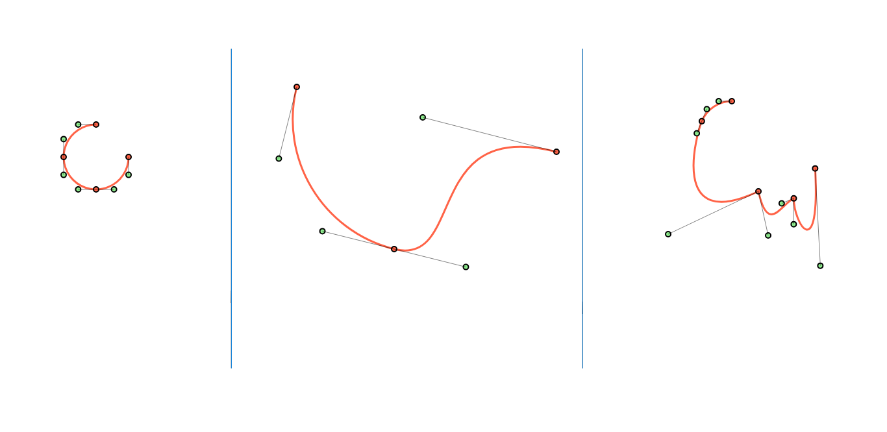

# ZakuJS

ZakuJS is a Js framework for dealing with svg path rigging and transition(animation)

## How it looks



## How it works

Zaku gets a svg path and appends control points to it, allowing you to modify the path(or shape) 
with your mouse and later set transition from the initial path to the current one.

## Installation
Add the library to your page
 
`<script src="dist/zaku.js"></script>`

## Usage

```javascript
    //#1 : Create a zaku instance
    var zaku = new zaku(); 
```

```javascript
    //#2 : Get a svg pathElement
    var elem = zaku.get('samba'); /*samba as ID*/
    
```


```javascript
    //#3 : Get the pathElement path data
    zaku.path(elem);
```

```javascript
    //#4 : Set control points on the path (shape)
    zaku.setpoints();
```


```javascript
    //#5 : Init manipulation actions (events)
    zaku.initEvents();
```

And That's All !

 

## Contributing
Pull requests are welcome. For major changes, please open an issue first to discuss what you would like to change.

Made with some [dakhaar](https://en.wikipedia.org/wiki/Tamarind) at [kayelsoft](http://www.kayelsoft.com) :) 


## Genesis :)

Zaku (Zakaria) is the nickname of one my terrible nephew. A real terror like this framework about manipulating svg-path . Yay :)


## License
[MIT](https://choosealicense.com/licenses/mit/)
